# 🏥 MediSync Backend

<div align="center">

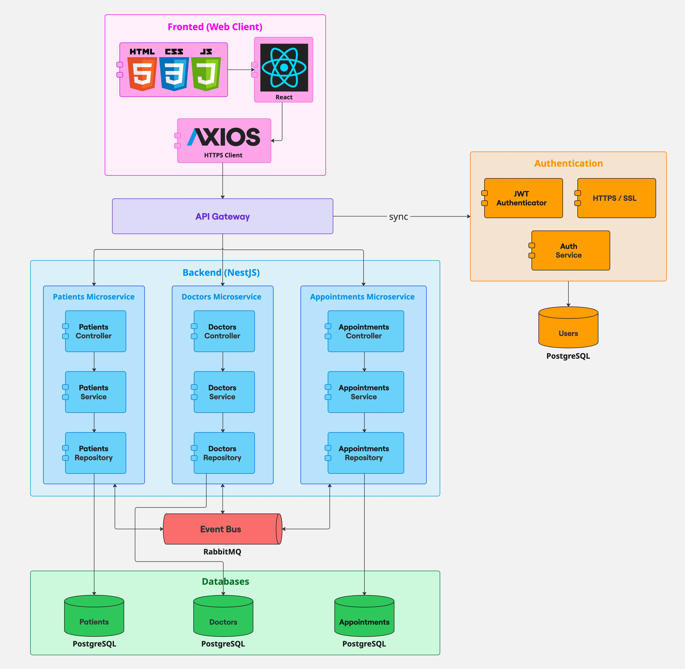

**MediSync** is an event-driven microservices backend for managing medical appointments.
Patients can schedule consultations with specialist doctors, choose available time slots,
and receive automated email confirmations — all powered by a clean, domain-centric architecture.

[](https://nodejs.org/)
[](https://nestjs.com/)
[](https://www.typescriptlang.org/)
[](https://www.postgresql.org/)
[](https://www.rabbitmq.com/)
[](LICENSE)

</div>

---

## 📋 Table of Contents

1. [About the Project](#-about-the-project)
2. [Architecture](#-architecture)
3. [Tech Stack](#-tech-stack)
4. [Project Structure](#-project-structure)
5. [Getting Started](#-getting-started)
   - [Prerequisites](#prerequisites)
   - [Installation](#installation)
   - [Environment Variables](#environment-variables)
   - [Running with Docker](#running-with-docker)
6. [API Reference](#-api-reference)
7. [Testing](#-testing)
8. [CI/CD & Deployment](#-cicd--deployment)
9. [Authors](#-authors)
10. [License](#-license)
11. [Additional Resources](#-additional-resources)

---

## 🩺 About the Project

**MediSync** solves the core workflow of a medical clinic's appointment system:

- A **patient** registers and can browse available doctors by specialty.
- A **doctor** profile includes specialties and weekly schedule slots.
- An **appointment** is created when a patient claims a slot; the system sends an email confirmation.
- All cross-service interactions are handled through **domain events** published to a **RabbitMQ** topic exchange, keeping services fully decoupled.

The system is designed for the *Arquitectura Centrada en el Negocio* (ARCN_M) university course and serves as a reference implementation for:
- **Hexagonal Architecture** (Ports & Adapters) with **Domain-Driven Design**
- **Event-driven microservices** with asynchronous messaging
- **Clean separation** of domain logic from infrastructure concerns

---

## 🏛️ Architecture

### 🔷 System Overview

The system consists of five independent **NestJS** microservices behind a single **API Gateway**:

```
React App  ──►  API Gateway (3000)
                    │
          ┌─────────┼──────────────┐
          ▼         ▼              ▼
  patient-service  doctor-service  appointments-service
      (3002)          (3003)            (3004)
          │              │                  │
          └──────────────┴──────────────────┘
                         │
                    RabbitMQ
               (topic exchange)
                         │
                    PostgreSQL
               (shared instance,
               one schema per service)
```

### 🔷 Domain-Driven Design

Each service applies **Hexagonal Architecture** internally:

```
src/
├── domain/          ← Core business logic — zero external imports
│   ├── entities/    ← Aggregate Roots (pure TypeScript)
│   ├── value-objects/
│   ├── events/      ← Domain Events
│   └── repositories/  ← Port interfaces (Dependency Inversion)
├── application/     ← Use cases — one class per operation
│   ├── use-cases/
│   ├── dtos/        ← Validated input/output shapes
│   └── ports/       ← Interfaces for event publisher, email, etc.
├── infrastructure/  ← Adapters — implement ports with real tech
│   ├── persistence/ ← TypeORM entities + repository implementations
│   ├── messaging/   ← RabbitMQ publisher + event handlers
│   └── notifications/ ← Email adapter (appointments-service only)
└── presentation/
    └── http/        ← NestJS controllers (HTTP adapter)
```

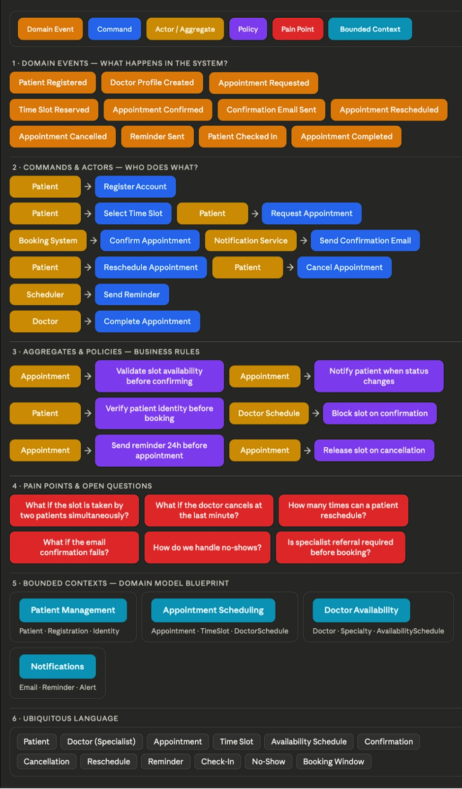

### 🔷 Entity Relationship Model


### 🔷 Event Contracts

All async communication uses the `medi-sync.events` **topic exchange**:

| Routing Key | Published by | Consumed by |
|---|---|---|
| `event.patient.registered` | `patient-service` | `appointments-service` |
| `event.doctor.profile-created` | `doctor-service` | `appointments-service` |
| `event.appointment.confirmed` | `appointments-service` | *(future)* |

---

## 🛠️ Tech Stack

| Layer | Technology | Version |
|---|---|---|
| Language | **TypeScript** | 5 |
| Framework | **NestJS** | 11 |
| ORM | **TypeORM** | latest |
| Database | **PostgreSQL** | 16 |
| Messaging | **RabbitMQ** | 3.13 |
| Validation | **class-validator** + **class-transformer** | — |
| Configuration | **@nestjs/config** + **Joi** | — |
| Containerisation | **Docker** + **Docker Compose** | — |
| Testing | **Jest** + **Supertest** | — |
| Static Analysis | **SonarCloud** | — |
| Runtime | **Node.js** | 20 LTS |

---

## 📁 Project Structure

```
medi-sync-backend/
├── assets/
│   ├── diagrams/               # Architecture and design diagrams
│   └── images/                 # Screenshots for documentation
├── contracts/
│   └── events/
│       ├── domain-events.json  # Event contract registry
│       └── commands.json       # Command contract registry
├── services/
│   ├── api-gateway/            # HTTP proxy — single entry point (port 3000)
│   ├── auth-service/           # Auth stub — out of current scope (port 3001)
│   ├── patient-service/        # Patient CRUD (port 3002)
│   ├── doctor-service/         # Doctor / specialty / schedule CRUD (port 3003)
│   └── appointments-service/   # Appointment lifecycle + email (port 3004)
├── .env.example                # Template — never commit .env
├── docker-compose.yml
├── sonar-project.properties
└── CLAUDE.md                   # Claude Code session context
```

---

## 🚀 Getting Started

### Prerequisites

Ensure the following tools are installed locally:

- **[Node.js 20 LTS](https://nodejs.org/)** — `node -v` should output `v20.x.x`
- **[Docker](https://www.docker.com/)** + **Docker Compose** — `docker -v`
- **[Git](https://git-scm.com/)** — `git -v`

> _Optional:_ [Postman](https://www.postman.com/) or any REST client to test the API endpoints manually.

### Installation

```bash
# 1. Clone the repository
git clone https://github.com/JAPV-X2612/medi-sync-backend.git
cd medi-sync-backend

# 2. Install dependencies for each service
cd services/patient-service && npm install && cd ../..
cd services/doctor-service  && npm install && cd ../..
cd services/appointments-service && npm install && cd ../..
cd services/api-gateway     && npm install && cd ../..
```

### Environment Variables

Copy the example file and fill in your values:

```bash
cp .env.example .env
```

Key variables to review:

| Variable | Default | Description |
|---|---|---|
| `POSTGRES_HOST` | `postgres` | Database host (use `localhost` outside Docker) |
| `POSTGRES_DB` | `medisync` | Database name |
| `POSTGRES_USER` | `medisync` | Database user |
| `POSTGRES_PASS` | `medisync` | Database password |
| `RABBITMQ_HOST` | `rabbitmq` | Broker host |
| `RABBITMQ_USER` | `guest` | Broker user |
| `RABBITMQ_PASS` | `guest` | Broker password |
| `RABBITMQ_VHOST` | `/` | Virtual host (use username for CloudAMQP) |
| `RABBITMQ_PROTOCOL` | `amqp` | Set `amqps` for TLS (e.g. CloudAMQP) |
| `CORS_ORIGIN` | `http://localhost:5173` | Allowed frontend origin |
| `SMTP_HOST` | `smtp.ethereal.email` | SMTP relay for email confirmations |

> **Important:** Never commit the `.env` file. The `.gitignore` excludes it by default.

### Running with Docker

```bash
# Build images and start all services (PostgreSQL, RabbitMQ, and all microservices)
docker compose up --build

# Run in detached mode
docker compose up --build -d

# Stop containers (preserves volumes)
docker compose down

# View logs for a specific service
docker compose logs -f patient-service
```

All services use `depends_on: condition: service_healthy` to ensure the database and
broker are fully ready before any microservice starts connecting.

#### Running a single service locally (without Docker)

```bash
# Start infrastructure only
docker compose up postgres rabbitmq -d

# Edit .env: set POSTGRES_HOST=localhost, RABBITMQ_HOST=localhost
cd services/patient-service
npm run start:dev
```

---

## 📡 API Reference

All requests go through the **API Gateway** at `http://localhost:3000`.

### 👤 Patients — `/patients`

| Method | Endpoint | Description |
|---|---|---|
| `POST` | `/patients` | Register a new patient |
| `GET` | `/patients` | List all patients |
| `GET` | `/patients/:id` | Get patient by ID |
| `PATCH` | `/patients/:id` | Update patient data |
| `DELETE` | `/patients/:id` | Remove a patient |

**Create Patient** — `POST /patients`

```json
{
  "firstName": "John",
  "lastName": "Doe",
  "email": "john.doe@example.com",
  "phone": "+1-555-0100",
  "dateOfBirth": "1990-06-15",
  "bloodType": "O+",
  "address": "123 Main Street"
}
```

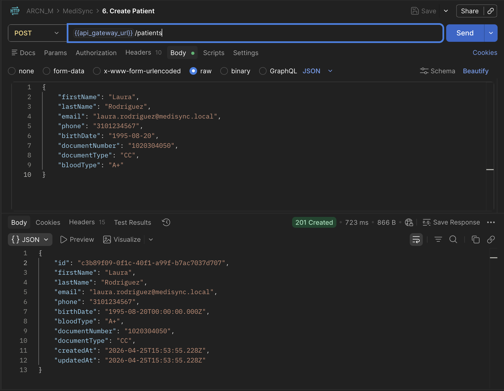

---

### 👨‍⚕️ Doctors — `/doctors`

| Method | Endpoint | Description |
|---|---|---|
| `POST` | `/doctors` | Create a doctor profile |
| `GET` | `/doctors` | List all doctors |
| `GET` | `/doctors/:id` | Get doctor by ID |
| `PATCH` | `/doctors/:id` | Update doctor profile |
| `DELETE` | `/doctors/:id` | Remove a doctor |

**Create Doctor** — `POST /doctors`

```json
{
  "firstName": "Maria",
  "lastName": "Garcia",
  "email": "maria.garcia@clinic.com",
  "licenseNumber": "MED-2024-001",
  "specialtyIds": ["<specialty-uuid>"],
  "schedules": [
    {
      "dayOfWeek": "MONDAY",
      "startTime": "08:00",
      "endTime": "12:00",
      "slotDurationMinutes": 30
    }
  ]
}
```

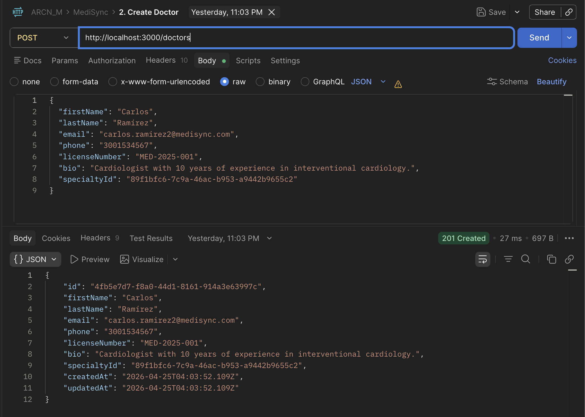

---

### 🔬 Specialties — `/specialties`

| Method | Endpoint | Description |
|---|---|---|
| `POST` | `/specialties` | Create a medical specialty |
| `GET` | `/specialties` | List all specialties |
| `GET` | `/specialties/:id` | Get specialty by ID |

**Create Specialty** — `POST /specialties`

```json
{
  "name": "Cardiology",
  "description": "Heart and cardiovascular system"
}
```

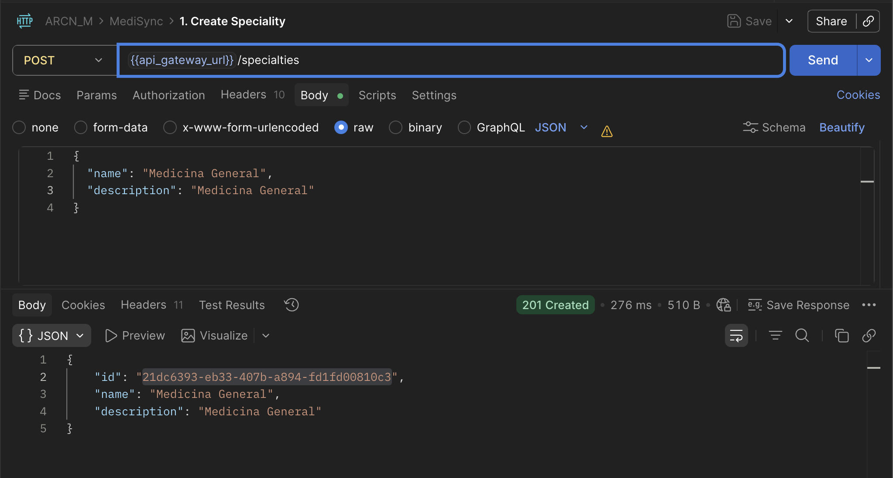

---

### 📅 Appointments — `/appointments`

| Method | Endpoint | Description |
|---|---|---|
| `POST` | `/appointments` | Book a new appointment |
| `GET` | `/appointments` | List all appointments |
| `GET` | `/appointments/:id` | Get appointment by ID |
| `PATCH` | `/appointments/:id/confirm` | Confirm an appointment |
| `PATCH` | `/appointments/:id/cancel` | Cancel an appointment |

**Create Appointment** — `POST /appointments`

```json
{
  "patientId": "<patient-uuid>",
  "doctorId": "<doctor-uuid>",
  "appointmentTime": "2026-05-10T09:00:00.000Z",
  "reason": "Annual check-up"
}
```

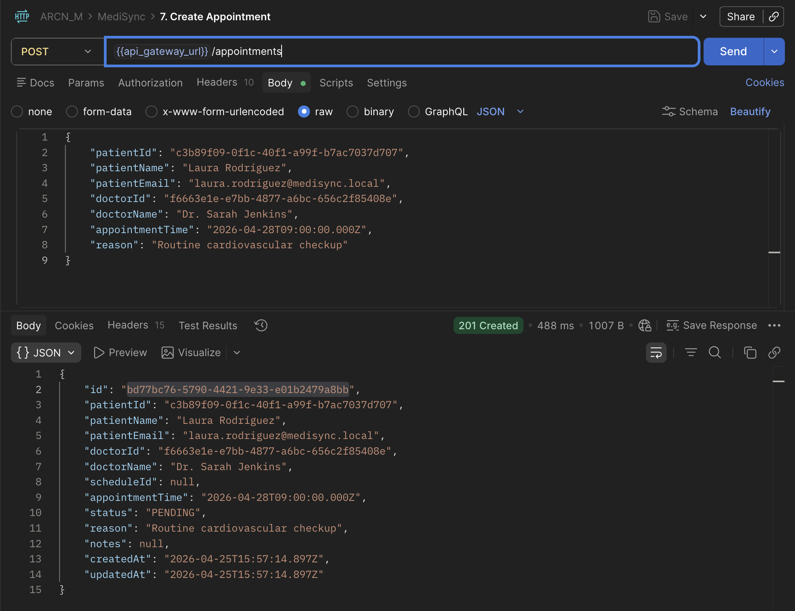

---

## 🧪 Testing

### Running Tests

```bash
# Run all unit tests for a service
cd services/patient-service
npm test

# Run with coverage report
npm run test:cov

# Run e2e tests
npm run test:e2e
```

### Coverage Requirements

The project enforces a **minimum 80% code coverage** threshold. Coverage reports are
generated in `coverage/lcov.info` and uploaded to **SonarCloud** for quality gate analysis.

### Test Results by Service

**Patient Service**

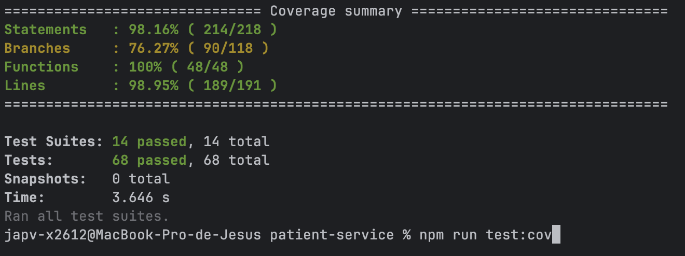

**Doctor Service**

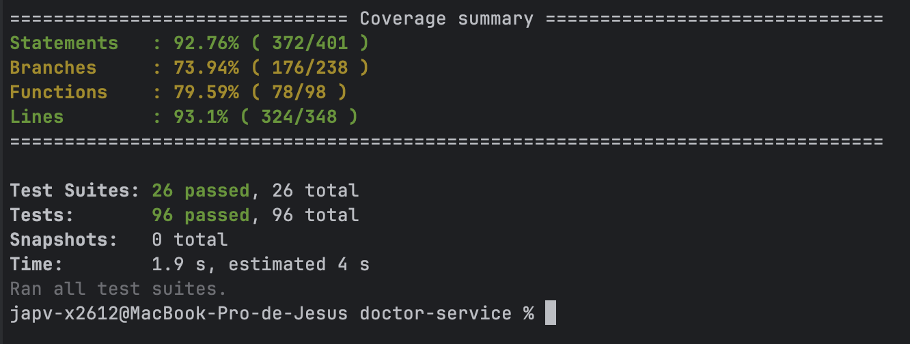

**Appointments Service**

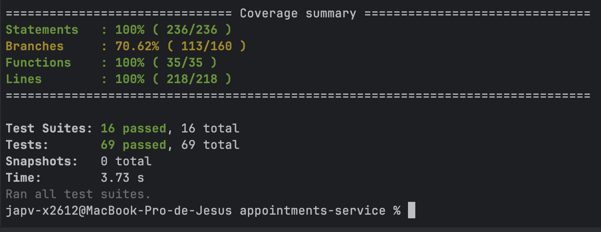

**API Gateway**

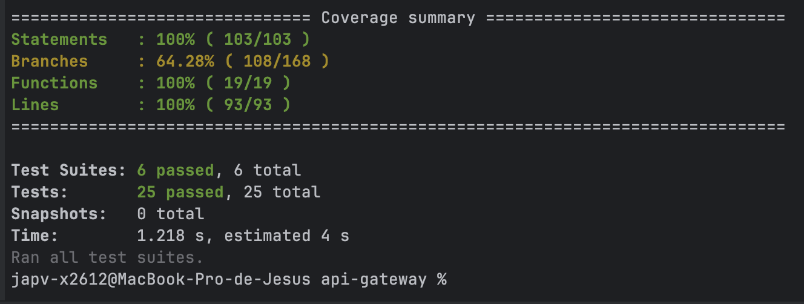

### SonarCloud Analysis

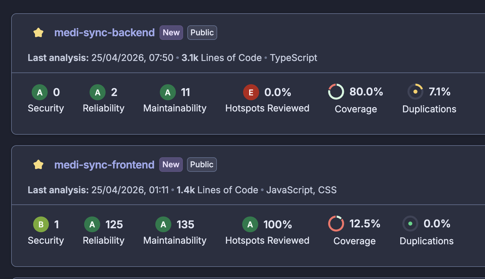

---

## ⚙️ CI/CD & Deployment

### GitHub Actions Pipeline

The backend CI/CD pipeline runs on every push to `main` and pull requests. It consists of three sequential stages:

1. **Build & Test** — Installs dependencies, compiles TypeScript, and runs `npm test --coverage` for all services.
2. **SonarCloud** — Uploads lcov reports and performs static analysis with a quality gate.
3. **Deploy** — Builds multi-stage Docker images and pushes them to **GitHub Container Registry** (GHCR). [Railway](https://railway.app/) pulls the new image and redeploys automatically.

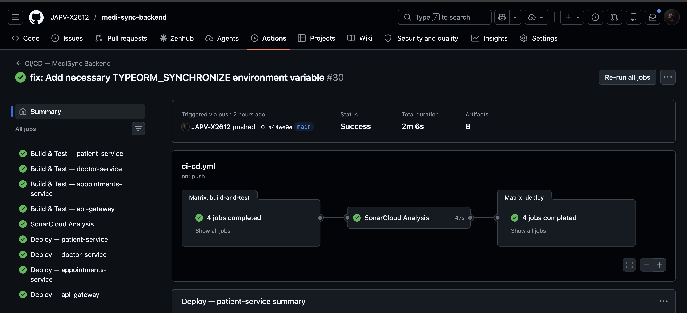

### Railway Deployment

The production environment runs on **[Railway](https://railway.app/)** with:
- One **PostgreSQL** plugin shared across all services (each service uses a dedicated schema)
- One **CloudAMQP** RabbitMQ instance (Lemur free tier, `amqps://` TLS on port `5671`)
- One Railway service per microservice, configured with environment variable references

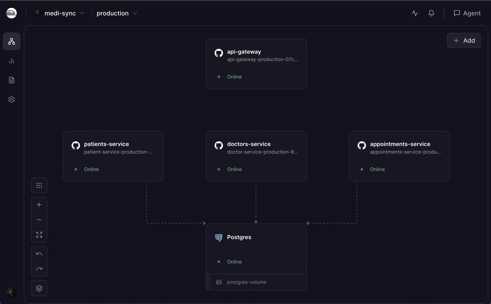

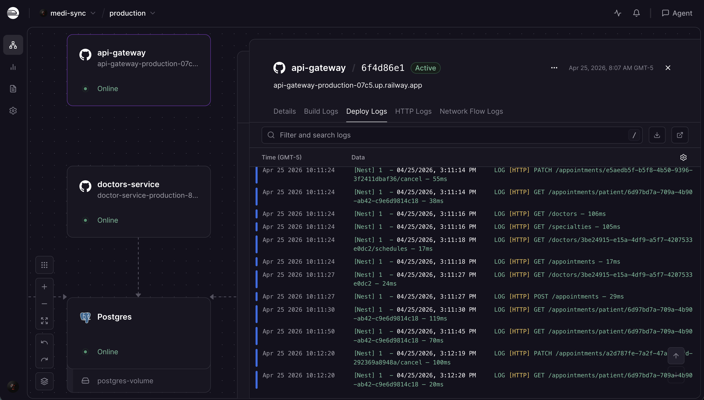

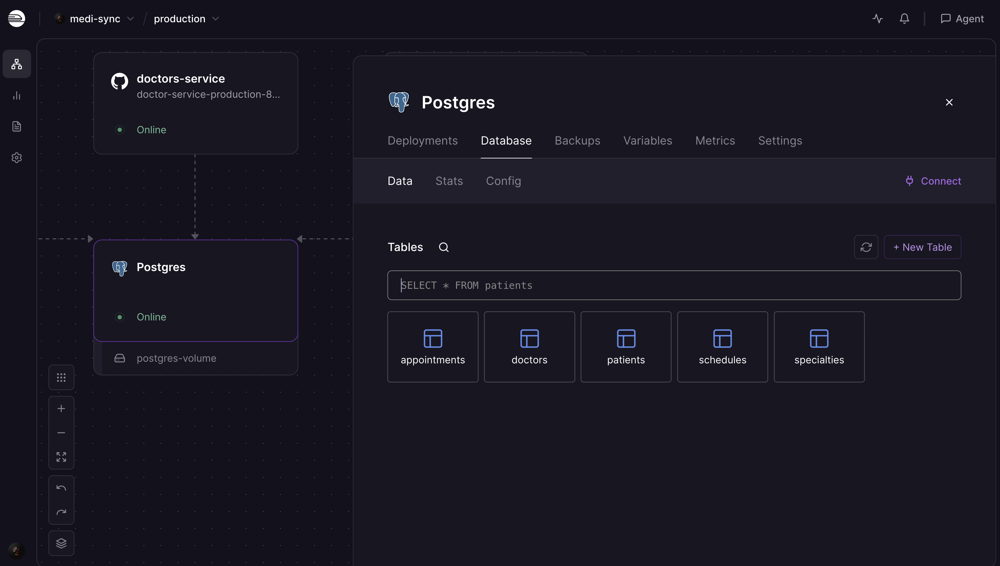

### RabbitMQ Queues

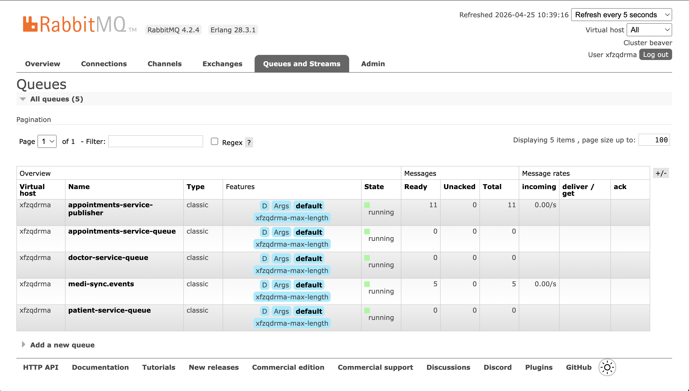

### Key Environment Variables for Production

| Variable | Description |
|---|---|
| `NODE_ENV` | Set to `production` |
| `RABBITMQ_PROTOCOL` | `amqps` for TLS (CloudAMQP) |
| `RABBITMQ_VHOST` | Username value for CloudAMQP Lemur tier |
| `CORS_ORIGIN` | Vercel frontend URL (e.g. `https://medi-sync.vercel.app`) |
| `TYPEORM_SYNCHRONIZE` | Set `true` once on first deploy to create tables; remove afterwards |

---

## 👥 Authors

<table>
  <tr>
    <td align="center">
      <a href="https://github.com/Andr3xDev">
        
        <br />
        <sub><b>Andrés Chavarro</b></sub>
      </a>
      <br />
      <sub>Full Stack Developer</sub>
    </td>
    <td align="center">
      <a href="https://github.com/JAPV-X2612">
        
        <br />
        <sub><b>Jesús Pinzón</b></sub>
      </a>
      <br />
      <sub>Full Stack Developer</sub>
    </td>
    <td align="center">
      <a href="https://github.com/LauraRo166">
        
        <br />
        <sub><b>Laura Rodríguez</b></sub>
      </a>
      <br />
      <sub>Full Stack Developer</sub>
    </td>
    <td align="center">
      <a href="https://github.com/SergioBejarano">
        
        <br />
        <sub><b>Sergio Bejarano</b></sub>
      </a>
      <br />
      <sub>Full Stack Developer</sub>
    </td>
  </tr>
</table>

---

## 📄 License

This project is distributed under the **Apache License, Version 2.0**.
See the [LICENSE](LICENSE) file for the full terms and conditions.

---

## 🔗 Additional Resources

- [NestJS Documentation](https://docs.nestjs.com/) — Official framework reference
- [TypeORM Documentation](https://typeorm.io/) — ORM for TypeScript and JavaScript
- [RabbitMQ Tutorials](https://www.rabbitmq.com/tutorials) — Topic exchange and routing key patterns
- [CloudAMQP — RabbitMQ as a Service](https://www.cloudamqp.com/docs/index.html) — Managed broker documentation
- [Domain-Driven Design Reference](https://www.domainlanguage.com/ddd/reference/) — Eric Evans' DDD reference guide
- [Hexagonal Architecture](https://alistair.cockburn.us/hexagonal-architecture/) — Alistair Cockburn's original article
- [Railway Documentation](https://docs.railway.app/) — Deployment and environment variable management
- [SonarCloud Documentation](https://docs.sonarcloud.io/) — Static analysis and quality gate configuration
- [Docker Compose Documentation](https://docs.docker.com/compose/) — Multi-container orchestration
- [class-validator](https://github.com/typestack/class-validator) — Decorator-based validation for TypeScript
